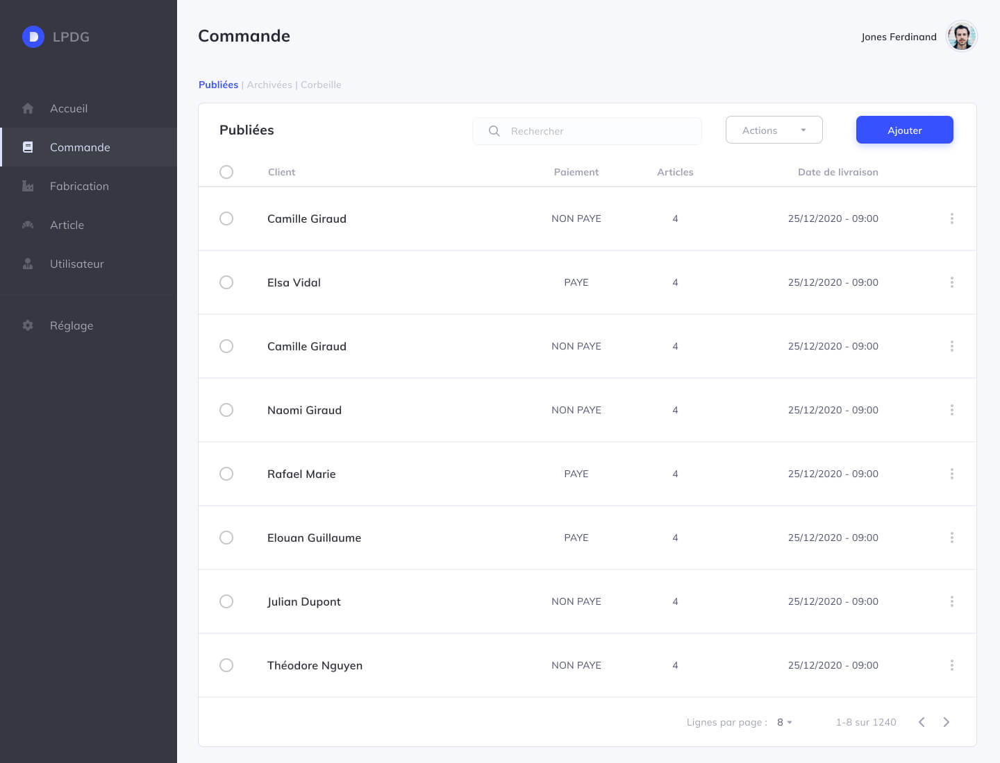

# LPDG
Order management tool



## Project setup

### Env file
Duplicate `.env.example` file ànd rename it to `.env` and complete it.
### Docker :
- Build docker project containers (only first time)
```
make build
```
* If docker containers are already build, start them
```
make start
```
### Backend :

```
composer install
```
### Frontend
```
yarn
```
```
yarn build
```

### Database and dummy data
Go inside docker container
```
make bash
```
If `APP_KEY` is not defined in `.env file`
```
php artisan key:generate
````
```
php artisan migrate --seed
````
